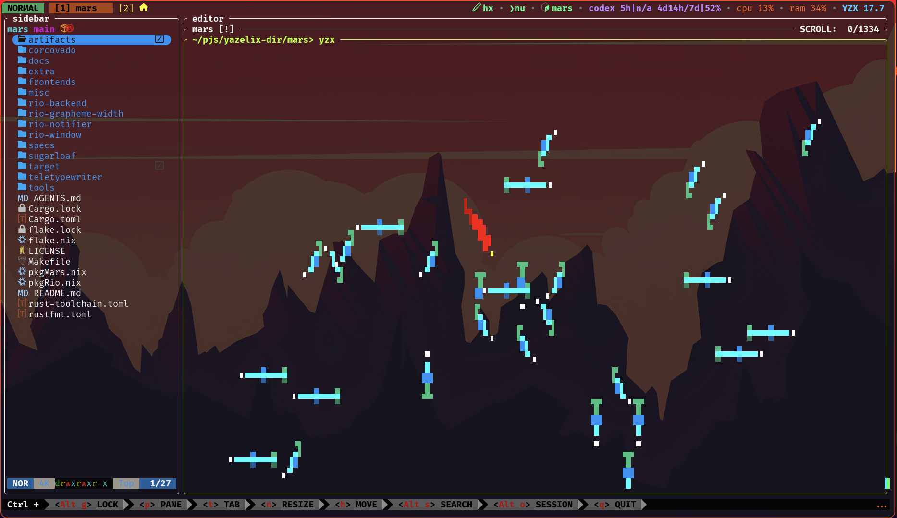
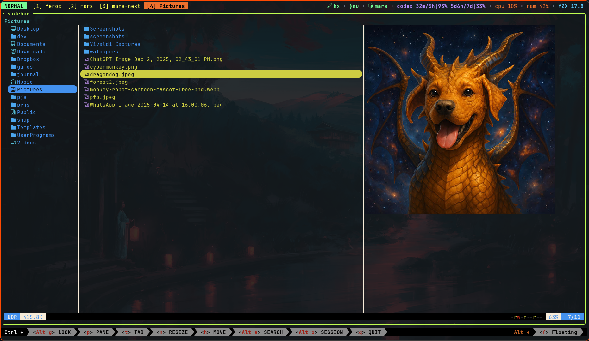

# Mars Terminal

<p align="center">
  
</p>

**Born from Rio. Built for Mars.**

Mars is a Rio-derived Rust terminal fork maintained by the author of Yazelix.

The project keeps Rio close enough to upstream to rebase deliberately, while
giving Yazelix a terminal stack it can control, test, package, and adapt when
terminal behavior matters. Mars aims for practical Ghostty parity, strong Kitty
protocol support, good Nix/runtime integration, and small measured changes
instead of broad fork drift.

Mars is the default packaged terminal for Yazelix, with Ghostty as a strong alternative.

Mars exists so the Rust terminal/runtime boundary can move with Yazelix if and when protocol, cursor, graphics, and packaging work needs it.

Mars adopts (carefully) agent-driven development with plenty of testing. 



## Current Shape

- The source tree is based on upstream Rio and still carries Rio crate names in
  many Rust packages
- The first-class Nix package is `.#mars`; `.#default` points at the same
  package
- The package wraps the upstream Rio binary as `bin/mars`, installs Mars desktop
  metadata and icons, and sets the app id to `mars`
- The package exposes `passthru.marsPackageMetadata` and installs the same data
  at `share/mars/package-metadata.json`
- The package includes generated Mars config roots for Yazelix:
  `share/mars`, `share/mars/baseline`, `share/mars/profiles/shaders`,
  and `share/mars/emoji/twitter`
- The package metadata advertises `MARS_APPEARANCE`, `MARS_EMOJI_FONT`,
  `MARS_EMOJI_FONT_SOURCE`, and `MARS_PROFILE` as the runtime environment
  contract consumed by Yazelix
- Mars config accepts `[mars.appearance] preset = "dark"`, `"light"`, or
  `"auto"`; `MARS_APPEARANCE` overrides that config value for package consumers
- Mars config accepts `[yazelix.cursor] preset = "reef"` using the Yazelix
  cursor registry names `blaze`, `snow`, `ice`, `midnight`, `cosmic`, `ocean`,
  `forest`, `sunset`, `eclipse`, `dusk`, `orchid`, `reef`, and `magma`; package
  metadata exposes the same list as `supported_cursor_presets` with
  `default_cursor_preset = "reef"`
- On Linux, the Nix wrapper provides a package-owned default Vulkan ICD path
  when `VK_ICD_FILENAMES` is unset, while preserving explicit user overrides
- Rio package outputs remain exposed as `.#rio`, `.#rio-msrv`, `.#rio-stable`,
  and `.#rio-nightly` for comparison and upstream maintenance work

## Mars Delta

The full fork audit trail lives in
[`docs/yazelix/change_scorecard.md`](docs/yazelix/change_scorecard.md). The
table below is the README-sized feature view.

| Area | Mars Behavior | Evidence |
| --- | --- | --- |
| Yazelix packaging | `.#mars` is the first-class package, with Mars metadata, config roots, launcher wrappers, desktop identity, and icon assets. | [`9df072cdfe`](https://github.com/luccahuguet/mars/commit/9df072cdfe), [`d9e303e8b7`](https://github.com/luccahuguet/mars/commit/d9e303e8b7) |
| Text and status glyphs | Mars uses Yazelix-tuned font defaults, Ghostty-style cell-baseline glyph placement, and constrained Nerd Font/status glyph sizing for balanced Yazelix bars. | [`ca72d7c581`](https://github.com/luccahuguet/mars/commit/ca72d7c581), [`f8e5fa60ee`](https://github.com/luccahuguet/mars/commit/f8e5fa60ee), [`b089bd1d97`](https://github.com/luccahuguet/mars/commit/b089bd1d97) |
| Theme and palette defaults | Packaged Mars profiles keep Yazelix palette values consistent across adaptive theme files and `[colors]`, avoiding washed-out status and glider colors. | [`809d8bece0`](https://github.com/luccahuguet/mars/commit/809d8bece0) |
| Quit confirmation | The quit confirmation overlay is a one-shot rounded modal with clear spacing and matching action buttons. | [`5820a9abf0`](https://github.com/luccahuguet/mars/commit/5820a9abf0), [`d44cf8e15e`](https://github.com/luccahuguet/mars/commit/d44cf8e15e), [`260a862d02`](https://github.com/luccahuguet/mars/commit/260a862d02) |
| Split cursors | Mars accepts hard-validated `[yazelix.cursor]` split-color config and renders split block, hollow, beam, underline, and trail sprites without mono fallback for malformed split config. | [`b545e539ec`](https://github.com/luccahuguet/mars/commit/b545e539ec), [`6b108cba5a`](https://github.com/luccahuguet/mars/commit/6b108cba5a) |
| Kitty graphics | Yazi previews that were fully broken render well through Kitty graphics; Mars derives omitted virtual-placement sizes and uses correct WGPU source-rect endpoint semantics for nonzero-origin slices. | [`f2d1ff45a8`](https://github.com/luccahuguet/mars/commit/f2d1ff45a8), [`011d648d83`](https://github.com/luccahuguet/mars/commit/011d648d83) |
| Link handling | Non-macOS link hints use Ctrl-click, URL hit spans are clipped to useful targets, and edge punctuation remains clickable without opening punctuation. | [`c2a49e7421`](https://github.com/luccahuguet/mars/commit/c2a49e7421), [`1a9dc553ec`](https://github.com/luccahuguet/mars/commit/1a9dc553ec), [`8e43f00c1d`](https://github.com/luccahuguet/mars/commit/8e43f00c1d) |
| Visual bell | `[bell].visual` draws a short full-window cue on BEL while keeping audio behavior independent. | [`1a80115ef9`](https://github.com/luccahuguet/mars/commit/1a80115ef9) |
| Nix runtime hardening | The Mars wrapper supplies a package-owned Vulkan ICD default when needed, preserves explicit overrides, and includes launch tracing for dogfooding failures. | [`3dd8210e70`](https://github.com/luccahuguet/mars/commit/3dd8210e70), [`01d732997c`](https://github.com/luccahuguet/mars/commit/01d732997c), [`a650371806`](https://github.com/luccahuguet/mars/commit/a650371806) |
| Performance evidence | Mars carries reproducible perf gates, parser/terminal/render benchmarks, and gated internal metrics for agent-driven diagnosis. | [`52952ad0c7`](https://github.com/luccahuguet/mars/commit/52952ad0c7), [`3cf912b9bf`](https://github.com/luccahuguet/mars/commit/3cf912b9bf), [`c69d02a716`](https://github.com/luccahuguet/mars/commit/c69d02a716), [`9f6d3a8fcd`](https://github.com/luccahuguet/mars/commit/9f6d3a8fcd) |

Mars renders Yazi image previews through Kitty graphics in the Yazelix runtime:



## Install

Build the Mars package with Nix:

```sh
nix build github:luccahuguet/mars#mars
./result/bin/mars
```

Install it into a Nix profile:

```sh
nix profile install github:luccahuguet/mars#mars
mars
```

Build from a local checkout:

```sh
nix build .#mars
./result/bin/mars
```

The Cargo workspace still follows upstream Rio's crate layout. Use Cargo for
source-level development and CI parity:

```sh
cargo build --release --features wgpu
```

## Yazelix Integration

Yazelix consumes Mars through the Nix package contract, not by guessing Rio
internals. The package metadata tells Yazelix where Mars configs live, which
emoji presets and appearance modes are supported, and which wrapper command to
launch.

Package metadata exposes the current runtime environment contract to Yazelix:

| Variable | Purpose |
| --- | --- |
| `MARS_BASE_CONFIG_HOME` | Supplies the immutable base config and theme assets; the packaged wrapper defaults it to `share/mars`. |
| `MARS_PROFILE` | Selects the full, baseline, or shaders profile config root. |
| `MARS_APPEARANCE` | Overrides `[mars.appearance] preset` with the dark, light, or auto palette mode. |
| `MARS_EMOJI_FONT` | Selects the Noto or Twitter/Twemoji emoji config root. |
| `MARS_EMOJI_FONT_SOURCE` | Carries the Yazelix-owned emoji source marker paired with `MARS_EMOJI_FONT`. |

Packaged Mars config roots are immutable bases with their theme and font assets.
`MARS_CONFIG_HOME` may point at a sparse user override; Mars merges it over the
base without copying package paths into mutable state.

For local Yazelix dogfooding, use the private launcher:

```sh
tools/mars_private_yazelix.py
```

Local dogfooding helpers also accept focused overrides:

| Variable | Purpose |
| --- | --- |
| `MARS_BINARY` | Runs a specific Mars binary instead of `mars`. |
| `MARS_CONFIG_HOME` | Uses a specific sparse user config directory over the package base. |
| `MARS_PRIVATE_CONFIG_HOME` | Uses a private launcher config root when `MARS_CONFIG_HOME` is unset. |

## Development

The Cargo workspace follows upstream Rio's crate layout and MSRV. Nix exposes
the Mars package and comparison Rio packages. Repository workflow rules live in
[`AGENTS.md`](AGENTS.md).

Useful project docs:

- [`docs/yazelix/fork_plan.md`](docs/yazelix/fork_plan.md)
- [`docs/yazelix/upstream_maintenance.md`](docs/yazelix/upstream_maintenance.md)
- [`docs/yazelix/clean_rio_rebuild_gate.md`](docs/yazelix/clean_rio_rebuild_gate.md)
- [`docs/yazelix/non_nix_graphics_launch_support.md`](docs/yazelix/non_nix_graphics_launch_support.md)

## Performance And Debugging

Mars keeps reproducible dogfooding tools in the repo. The performance gate
launches Mars with deterministic workloads and writes artifacts under
`artifacts/dogfooding/`.

Run the default suite:

```sh
tools/mars_perf_gate.py --suite --seconds 20
```

Run one scenario:

```sh
tools/mars_perf_gate.py --suite --scenario pty_flood --seconds 20
```

Enable gated internal PTY/render metrics for suite-launched Mars:

```sh
tools/mars_perf_gate.py --suite --scenario pty_flood --seconds 20 --internal-metrics
```

Trace a launch boundary:

```sh
mars-launch-trace -- mars -e true
```

## Verification

Useful local checks:

```sh
cargo fmt -- --check --color always
cargo clippy --all-targets --all-features
cargo test --features wgpu
nix build .#mars --no-link --print-build-logs
actionlint .github/workflows/release.yml
```

The GitHub `Test` workflow runs native Linux, macOS, and Windows Rust checks,
plus MSYS2 release builds for `MINGW64`, `UCRT64`, and `CLANG64`.

The GitHub `Nix Build` workflow builds the flake package on Linux ARM.

## Current Limits

Nix and source builds are the validated first-party Mars surfaces. Inherited
Rio release packaging still needs Mars-specific identity, smoke tests, and
support decisions before it is described as supported.

Packaging follow-ups are tracked in public issues:

| Surface | Status |
| --- | --- |
| Linux `.deb`/`.rpm` | Native package artifact restoration is tracked in [#2](https://github.com/luccahuguet/mars/issues/2). |
| Flatpak | Flatpak graphics packaging is tracked in [#3](https://github.com/luccahuguet/mars/issues/3). |
| AppImage / portable Linux | Portable Linux packaging is tracked in [#4](https://github.com/luccahuguet/mars/issues/4). |
| macOS | macOS artifact support is tracked in [#5](https://github.com/luccahuguet/mars/issues/5). |
| Windows | Windows artifact support is tracked in [#6](https://github.com/luccahuguet/mars/issues/6). |
| Release secrets | GoReleaser and signing policy is tracked in [#7](https://github.com/luccahuguet/mars/issues/7). |

Runtime dogfooding is strongest on Linux through Yazelix and Nix. The test
workflow runs Rust checks on Linux, macOS, and Windows, and MSYS2 release-build
checks on Windows, but interactive macOS validation and broad Windows runtime
validation remain limited.

## Release Status

The release workflow is intentionally limited to `v*.*.*` tags and manual
dispatch. It uses inherited GoReleaser Pro release machinery, requires
`GORELEASER_KEY` for release execution, and only configures Apple signing when
signing secrets are present.

The release-secrets decision is tracked in
[#7](https://github.com/luccahuguet/mars/issues/7) and Bead `yzt-c2d`. Until
that is resolved, treat Nix builds and source builds as the validated
first-party surfaces, and treat inherited Rio release packaging as a path to
evaluate instead of a public Mars guarantee.

## Upstream

Mars inherits substantial code and history from
[Rio](https://github.com/raphamorim/rio). Rio is an incredible project, and
Mars is grateful to Raphael Amorim, Rio's creator, and to everyone who has
contributed to Rio.

Upstream Rio remains the baseline for terminal behavior, renderer fixes, and
cross-platform packaging context. Mars should upstream generic fixes when they
are useful beyond Yazelix.

## Trivia

Like Rio's creator, I was also born in Rio de Janeiro.

## License

Mars follows Rio's MIT licensing.
